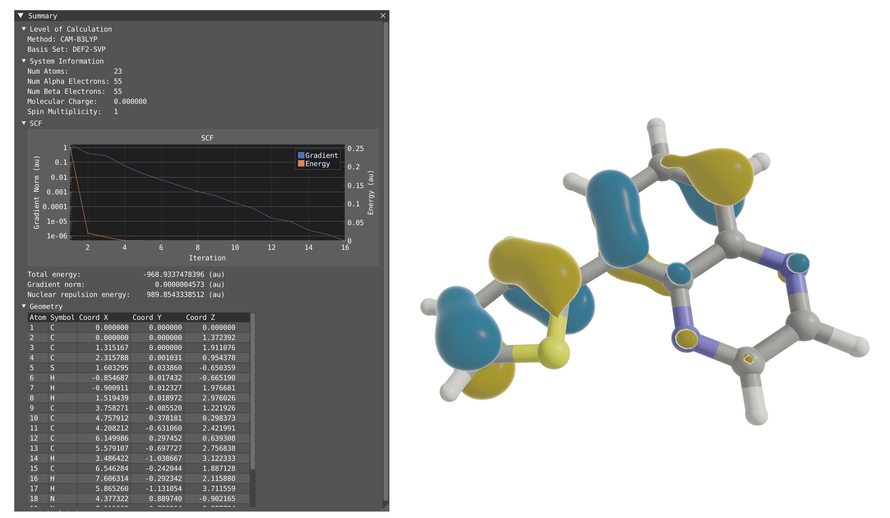

(sec:viamd)=
# VIAMD software
```{image} ../images/logo/viamd_logo_hires.png
:width: 300px
:align: center
```
[VIAMD](https://github.com/scanberg/viamd/) is an interactive visualization software originally developed for molecular dynamics analysis, but now updated to support VeloxChem output. 
```{margin}
[](https://www.linkedin.com/company/VIAMD/)
```
VIAMD natively reads HDF5 (*.h5) files produced by VeloxChem, which contain detailed orbital information. This enables users to efficiently render and analyze molecular orbitals and spectra from VeloxChem calculations with VIAMD, providing a powerful and seamless workflow for exploring quantum chemical calculations visually.

:::{image} ../images/viamd-vlx.png
:width: 800px
:align: center
:::

```{margin}
[](https://bsky.app/profile/viamd.bsky.social)
```

## Installing VIAMD
You can find detailed information on how to [install](https://github.com/scanberg/viamd/wiki/0.-Building) VIAMD and read VeloxChem outfile file on the [VIAMD GitHub](https://github.com/scanberg/viamd/wiki/7.-VIAMD-for-VeloxChem).

* Step 1: Get up to date with VIAMD

Pull the latest version:

```git pull --recurse-submodules```

* Step 2: Install dependencies 
Apart from the other dependencies, VIAMD needs the libhdf5-serial-dev library for handling the VeloxChem's hdf5 files.

For Ubuntu:
```sudo apt-get install libhdf5-serial-dev```

For Mac:
```brew install hdf5```

* Step 3: Configure using CMAKE
```
cd viamd
mkdir build
cd build
cmake -DVIAMD_ENABLE_VELOXCHEM=ON -DMD_ENABLE_VLX=ON ..
```
At this stage, the path to the h5 libraries should be defined.

* Step 4: Build
```
cmake --build .
```

* Step 5: Run
```
cd bin
./viamd
```

## Visualizing VeloxChem output
As output, VeloxChem is producing a file.out and a file.h5. Only the h5 file is used for visualization in VIAMD. For the following examples we are going to use output files provided on the [file examples page](#sec:input-file-examples).
### Loading and Representations
There is two ways to load a Veloxchem h5 file in VIAMD:
* By using the menu *File* -> *Load Data*, load the file.h5
* Alternatively you can drag and drop the file.h5 in VIAMD.

By default VIAMD is going to create two representations, one for the atomic structure using Ball and Stick representation, and one for the electronic structure, with the HOMO orbital represented by default.

<p align="center">

</p>

In addition to the orbital, one can also plot the Molecular Orbital Density (square of the orbital) or the Electron Density.
| Molecular Orbital Density    | Electron Density |
| -------- | ------- |
|||

### Summary Window
By clicking on *Windows* > *VeloxChem* > *Summary*, you will display the Summary window which contains:
* The level of calculation (functionnal and basis set)
* System information (# of atoms, # of electrons, charge and spin multiplicity)
* SCF convergence
* An interactive table of the geometry



### Orbital grid
By clicking on *Windows* > *VeloxChem* > *Orbital Grid*, you will display the Orbital Grid.

<p align="center">

</p>

The grid is tunable in dimension up to 4 x 4, one can change the color for the positive and negative phase of the orbital as well as the transparency. The table on the left shows all the orbitals and their energy and occupancy, the orbital showed in the grid are highlighted in grey in the table.

### Response and Transition 
In the output file provided we have calculated the absorption and circular dichroism for the first 10 excited states and saved the NTO as requested in the input file.

```
@response
property: absorption
nstates: 10
nto: yes
@end
```
To open the response windows and visualize your spectra, click on *Windows* > *VeloxChem* > *Response*

In the response window, you can choose your unit for the x-axis, choose a broadening type and value. By clicking on a specific peak, you will display information about this state. By clicking on *File* > *Export* in the response window, you can export your spectra to xvg or csv file.

<p align="center">

</p>

To open the Transition Analysis windows and analyze the different transitions, click on *Windows* > *VeloxChem* > *Transition Analysis*.
The Response and Transition Analysis windows are interactively connected, so clicking on the peak in the response window will activate this specific state in the transition Analysis window and vice versa.

<p align="center">

</p>

In the transition analysis window, the attachment and detachment density are built from the NTO for each excited state. The electric and magnetic transition dipole moment are also shown. In Settings, one can change the color of the density as well as the color and scaling factor of the transition dipole moments.

<p align="center">

</p>

The point of the transition analysis window is to study the transition in more details and to decompose it in terms of subgroups of your system to determine local excitation versus charge transfer character. By default, the system understudy is divided in two based on the atom number but the user can redefine the groups. By clicking on edit mode, one can delete the existing group 
(red cross) to start with a blank canvas. To select, one can use the shift + left-click on specific atom or click and drag. To unselect use shift + right-click. Shift + left-click on background will unselect everything. Try to select all the atoms of the thiophene ring and then right click on one of the atom and click on *Assign to new goup*. Repeat the operation for the quinoxaline moiety.

<p align="center">

</p>

By clicking on Edit mode, you can rename the groups to THIO and QUIN to update the transition diagram. The bottom part of the transition diagram gives the distribution of the detachment density between the two groups, and the top part gives the distribution of the attachment density between the two groups. The middle part of the diagram indicates the transfer between the two groups upon the studied electronic transition. For instance, the first excited state is dominated at 73 % by a local excitation on the quinoxaline moiety while the fourth state exhibit a clear charge transfer character with 53% of the charge being transfered from the thiophene to the quinoxaline.
| First Excited State | Fourth Excited State |
| -------- | ------- |
| | |


